# データベースER図

## 概要
このドキュメントではAI営業アシスタントのデータベース構造をER図で表現しています。

## 主要テーブル関連図

```mermaid
erDiagram
    %% ユーザー関連
    users ||--o{ profiles : "has"
    users ||--o{ products : "owns"
    users ||--o{ companies : "manages"
    users ||--o{ batch_jobs : "creates"
    users ||--o{ user_settings : "configures"
    users ||--o{ job_templates : "creates"

    %% 製品関連
    products ||--o{ product_files : "contains"
    products ||--o{ batch_jobs : "used_in"

    %% 企業関連
    companies ||--o{ batch_job_companies : "included_in"
    companies ||--o{ generated_content : "target_of"
    companies ||--o{ sending_group_companies : "belongs_to"
    companies ||--o{ crawl_queue : "queued_for"
    companies ||--o{ search_logs : "searched_for"

    %% バッチジョブ関連
    batch_jobs ||--o{ batch_job_companies : "targets"
    batch_jobs ||--o{ generated_content : "produces"
    batch_jobs ||--o{ job_logs : "logs"
    batch_jobs ||--o| batch_job_snapshots : "has"

    %% 送信グループ関連
    sending_groups ||--o{ sending_group_companies : "contains"
    sending_groups ||--o{ batch_jobs : "used_by"

    %% テンプレート関連
    job_templates ||--o{ template_tags : "tagged_with"
    tags ||--o{ template_tags : "used_in"

    %% クロール関連
    crawl_queue ||--o{ crawl_batch_queue : "grouped_in"

    users {
        uuid id PK
        text email
        text password_hash
    }

    profiles {
        uuid id PK
        uuid user_id FK
        text name
        text company
        text department
        text job_title
        text phone
        text gender
        text name_kana
        text email
        text address
        date birth_date
        text postal_code
        text prefecture
        text city
        text company_description
    }

    user_settings {
        uuid id PK
        uuid user_id FK
        text anthropic_api_key
        text openai_api_key
        text selected_model
        text domain_restriction
        text custom_prompt
        int company_limit
        text footer_text
        boolean use_footer
        text preferred_method
    }

    products {
        uuid id PK
        uuid user_id FK
        text name
        text description
        text price_range
        jsonb case_studies "事例情報"
        text[] benefits "製品のメリット"
        text[] solutions "提供ソリューション"
        text challenges
        timestamp created_at
        timestamp updated_at
    }

    product_files {
        uuid id PK
        uuid product_id FK
        text file_name
        text file_type
        text file_path
        int file_size
        text status
        timestamp created_at
    }

    companies {
        uuid id PK
        uuid user_id FK
        text name
        text url
        text industry
        text description
        text contact_email
        text contact_form_url
        text notes
        text website_content
        timestamp last_crawled_at
        text business_description
        text phone
        text address
        company_size_type company_size "1-10/11-50/51-200/201-500/501-1000/1001+"
        text location
        timestamp created_at
        timestamp updated_at
    }

    batch_jobs {
        uuid id PK
        uuid user_id FK
        uuid product_id FK
        uuid sending_group_id FK
        text name
        text description
        text status
        int total_tasks
        int completed_tasks
        text error_message
        sending_method_type preferred_method "form/dm"
        text content_directives
        jsonb metrics_settings "テンプレートから継承したKPI設定"
        jsonb metrics_results "KPI実績（current, historical）、業界分析（industry_analysis）、改善分析（improvement_analysis: scores, findings, opportunities, actions）"
        timestamp scheduled_at
        timestamp started_at
        timestamp completed_at
        timestamp created_at
        timestamp updated_at
    }

    generated_content {
        uuid id PK
        uuid user_id FK
        uuid company_id FK
        uuid batch_job_id FK
        text content
        text product
        text subject
        form_submission_status_type status
        int attempt_count
        timestamp last_attempt_at
        text error_message
        jsonb result
        text form_url
        text fallback_status
    }

    sending_groups {
        uuid id PK
        uuid user_id FK
        text name
        text description
    }

    job_templates {
        uuid id PK
        uuid user_id FK
        text name
        text description
        boolean recommended
        int success_rate
        int average_time
        int usage_count
        float average_response_rate
        boolean is_public
        jsonb settings "実行設定（mode, strategy, tone_of_voice, execution_type, preferred_method: 'form'/'dm'等）"
        text template_settings "メッセージ戦略の詳細設定（basicInfo, strategy, execution, kpi等をJSON形式で保存）"
        template_category category
        timestamp deleted_at
        timestamp created_at
        timestamp updated_at
    }

    crawl_queue {
        uuid id PK
        uuid company_id FK
        text status "pending/processing/completed/failed"
        int retry_count
        text error_message
        timestamp next_retry_at
        timestamp processing_started_at
        interval processing_duration
        timestamp created_at
        timestamp updated_at
    }

    crawl_batch_queue {
        uuid batch_id PK
        timestamp created_at
        boolean processed
    }

    job_logs {
        uuid id PK
        uuid job_id FK
        uuid task_id
        text message
        text log_level
    }

    error_logs {
        uuid id PK
        text error_message
        text error_stack
        jsonb context
    }

    search_logs {
        uuid id PK
        uuid user_id FK
        uuid company_id FK
        text query
    }

    llm_models {
        int id PK
        text model_name
        text api_type
    }

    batch_job_companies {
        uuid id PK
        uuid batch_job_id FK "UNIQUE with company_id"
        uuid company_id FK "UNIQUE with batch_job_id"
        timestamp created_at
    }

    batch_job_tasks {
        uuid id PK
        uuid batch_job_id FK
        uuid company_id FK
        text status "生成中/レビュー待ち/承認済み/要修正"
        int quality_score "0-100の品質スコア"
        text review_comment "レビューコメント"
        timestamp review_requested_at
        timestamp reviewed_at
        timestamp approved_at
        timestamp created_at
        timestamp updated_at
    }

    sending_group_companies {
        uuid id PK
        uuid sending_group_id FK "UNIQUE with company_id"
        uuid company_id FK "UNIQUE with sending_group_id"
        timestamp created_at
    }

    template_tags {
        uuid id PK
        uuid template_id FK "UNIQUE with tag_id"
        uuid tag_id FK "UNIQUE with template_id"
        timestamp created_at
    }

    tags {
        uuid id PK
        text name
        text color
        text description
        timestamp created_at
        timestamp updated_at
    }

    process_logs {
        bigint id PK
        timestamp timestamp
        text level "info/warn/error"
        text message
        jsonb metadata
        timestamp created_at
    }

    batch_job_submissions {
        uuid id PK
        uuid batch_job_id FK
        uuid company_id FK
        uuid generated_content_id FK
        submission_status status
        timestamp scheduled_at
        timestamp started_at
        timestamp completed_at
        int retry_count
        text error_message
        interval processing_duration
        jsonb submission_result
        timestamp created_at
        timestamp updated_at
    }

    template_improvement_suggestions {
        uuid id PK
        uuid template_id FK
        uuid batch_job_id FK "Optional - バッチジョブからの改善提案の場合"
        jsonb content_suggestions "コンテンツ構造の改善案"
        jsonb prompt_optimizations "プロンプトの最適化案"
        jsonb tone_adjustments "トーン設定の調整案"
        jsonb variable_suggestions "変数活用の改善案"
        float expected_improvement "期待される改善率"
        timestamp applied_at "提案が適用された日時"
        timestamp created_at
        timestamp updated_at
    }

    template_suggestion_results {
        uuid id PK
        uuid suggestion_id FK
        uuid batch_job_id FK
        float actual_improvement "実際の改善率"
        jsonb performance_comparison "適用前後のパフォーマンス比較"
        timestamp created_at
    }

    batch_job_snapshots {
        uuid id PK
        uuid batch_job_id FK "バッチジョブへの参照"
        jsonb product_snapshot "プロダクトのスナップショット"
        jsonb template_snapshot "テンプレートのスナップショット"
        jsonb sending_group_snapshot "送信グループのスナップショット"
        jsonb company_snapshots "対象企業のスナップショット配列"
        jsonb metrics_settings "実行時のKPI設定"
        timestamp created_at
    }

    task_review_comments {
        uuid id PK
        uuid task_id FK "batch_job_tasksへの参照"
        uuid user_id FK "コメント投稿者"
        uuid parent_comment_id FK "返信先コメントID（オプション）"
        text comment "コメント内容"
        jsonb highlighted_text "指摘箇所のテキスト範囲情報"
        timestamp created_at
        timestamp updated_at
    }

    submission_error_details {
        uuid id PK
        uuid submission_id FK "batch_job_submissionsへの参照"
        text error_type "エラーの種類（validation/network/system等）"
        text error_code "エラーコード"
        jsonb error_context "エラー発生時のコンテキスト情報"
        jsonb troubleshooting_steps "トラブルシューティング手順"
        text resolution_status "解決状態"
        timestamp created_at
        timestamp updated_at
    }
```



## ENUMタイプ定義

### コンテンツ関連
```sql
CREATE TYPE content_focus AS ENUM (
    'benefit',
    'technical',
    'case-study',
    'roi',
    'relationship'
);

CREATE TYPE form_submission_status_type AS ENUM (
    'pending',
    'success',
    'form_not_found',
    'submission_failed'
);

CREATE TYPE metric_type AS ENUM (
    'system',
    'custom'
);

CREATE TYPE company_size_type AS ENUM (
    '1-10',
    '11-50',
    '51-200',
    '201-500',
    '501-1000',
    '1001+'
);

CREATE TYPE submission_status AS ENUM (
    'pending',
    'sending',
    'completed',
    'failed'
);
```

### テトリクス結果のJSONB構造
```json
// batch_jobs.metrics_results の構造
{
    "current": {
        "form_click": {
            "value": 85,
            "achievement_rate": 0.85,
            "trend": 0.1
        },
        "click_rate": {
            "value": 0.081,
            "achievement_rate": 0.54,
            "trend": -0.05
        }
    },
    "historical": [
        {
            "timestamp": "2024-01-10T00:00:00Z",
            "metrics": {
                "form_click": 75,
                "click_rate": 0.085
            }
        }
    ],
    "industry_analysis": {
        "IT": {
            "response_rate": 0.38,
            "conversion_rate": 0.15
        },
        "Manufacturing": {
            "response_rate": 0.32,
            "conversion_rate": 0.10
        }
    },
    "improvement_analysis": {
        "scores": {
            "quality": {
                "current": 85,
                "previous": 70,
                "trend": 0.15
            },
            "efficiency": {
                "current": 78,
                "previous": 65,
                "trend": 0.13
            },
            "total": {
                "current": 82,
                "previous": 68,
                "trend": 0.14
            }
        },
        "findings": [
            {
                "type": "success",
                "title": "コンテンツ品質の向上",
                "description": "前回比で品質スコアが15%向上",
                "metrics": {
                    "current": 85,
                    "previous": 70
                }
            }
        ],
        "opportunities": [
            {
                "title": "送信時間の最適化",
                "expected_improvement": 0.15,
                "difficulty": "low",
                "impact_scope": "40% of tasks"
            }
        ],
        "recommended_actions": [
            {
                "title": "業界別キーワードの追加",
                "priority": "high",
                "status": "pending",
                "expected_improvement": 0.25
            }
        ],
        "next_batch_suggestions": [
            {
                "title": "ターゲティングの改善",
                "expected_improvement": 0.20,
                "priority": 1
            }
        ]
    }
}
```

### テンプレート関連
```sql
CREATE TYPE template_category AS ENUM (
    'new-client-acquisition',
    'existing-client',
    'proposal',
    'follow-up',
    'event-announcement'
);

CREATE TYPE template_mode AS ENUM (
    'ai_auto',
    'manual'
);

CREATE TYPE template_strategy AS ENUM (
    'benefit-first',
    'problem-solution',
    'story-telling',
    'direct-offer'
);

CREATE TYPE template_tone AS ENUM (
    'formal',
    'professional',
    'friendly',
    'casual'
);

CREATE TYPE template_parallelism AS ENUM (
    '低',
    '中',
    '高'
);

CREATE TYPE template_reliability AS ENUM (
    '安定重視',
    'バランス',
    'スピード重視'
);

CREATE TYPE template_retry_strategy AS ENUM (
    '最小限',
    '標準',
    '粘り強い'
);

CREATE TYPE template_speed AS ENUM (
    '高速',
    '標準',
    '慎重'
);
```

### 実行関連
```sql
CREATE TYPE execution_priority AS ENUM (
    'speed',
    'balanced',
    'quality'
);
```

### タスクステータス
```sql
CREATE TYPE task_status AS ENUM (
    'generating',
    'review_pending',
    'approved',
    'needs_revision'
);
```

## トリガー関数

### 企業クロール関連
```sql
CREATE FUNCTION handle_company_crawl() RETURNS trigger
    LANGUAGE plpgsql SECURITY DEFINER AS $$
BEGIN
  -- crawl_queueにエントリを追加
  INSERT INTO public.crawl_queue (company_id, status, retry_count)
  VALUES (NEW.id, 'pending', 0);

  -- 現在のバッチを取得または新規作成
  SELECT batch_id INTO current_batch_id
  FROM public.crawl_batch_queue
  WHERE processed = false
  AND created_at > now() - interval '1 minute'
  ORDER BY created_at DESC
  LIMIT 1;

  IF current_batch_id IS NULL THEN
    INSERT INTO public.crawl_batch_queue DEFAULT VALUES
    RETURNING batch_id INTO current_batch_id;
  END IF;

  RETURN NEW;
END;
$$;
```

### ユーザー関連
```sql
CREATE FUNCTION handle_new_user() RETURNS trigger
    LANGUAGE plpgsql SECURITY DEFINER AS $$
BEGIN
  INSERT INTO public.profiles (id, name, company)
  VALUES (
    new.id,
    new.raw_user_meta_data->>'name',
    new.raw_user_meta_data->>'company'
  );
  RETURN new;
END;
$$;
```

### 更新日時関連
```sql
CREATE FUNCTION set_updated_at() RETURNS trigger
    LANGUAGE plpgsql AS $$
BEGIN
  NEW.updated_at = NOW();
  RETURN NEW;
END;
$$;
```

## インデックス

### ユーザー関連
```sql
CREATE INDEX idx_profiles_department ON profiles USING btree (department);
CREATE INDEX idx_profiles_email ON profiles USING btree (email);
CREATE INDEX idx_profiles_gender ON profiles USING btree (gender);
CREATE INDEX idx_profiles_job_title ON profiles USING btree (job_title);
CREATE INDEX idx_profiles_name_kana ON profiles USING btree (name_kana);
CREATE INDEX idx_profiles_phone ON profiles USING btree (phone);
CREATE INDEX idx_profiles_postal_code ON profiles USING btree (postal_code);
CREATE INDEX idx_profiles_prefecture ON profiles USING btree (prefecture);
```

### 企業関連
```sql
CREATE INDEX idx_companies_employee_count ON companies USING btree (employee_count);
CREATE INDEX idx_companies_founded_year ON companies USING btree (founded_year);
CREATE INDEX idx_companies_industry ON companies USING btree (industry);
CREATE INDEX idx_companies_user_id ON companies USING btree (user_id);
CREATE INDEX idx_companies_user_id_name ON companies USING btree (user_id, name);
```

### バッチジョブ関連
```sql
CREATE INDEX idx_batch_jobs_sending_group_id ON batch_jobs USING btree (sending_group_id);
CREATE INDEX idx_batch_jobs_status ON batch_jobs USING btree (status);
CREATE INDEX idx_batch_jobs_user_id ON batch_jobs USING btree (user_id);
CREATE INDEX idx_batch_jobs_user_id_product_id_status ON batch_jobs USING btree (user_id, product_id, status);
```

### 生成コンテンツ関連
```sql
CREATE INDEX idx_generated_content_batch_job_id ON generated_content USING btree (batch_job_id);
CREATE INDEX idx_generated_content_company_id ON generated_content USING btree (company_id);
CREATE INDEX idx_generated_content_product ON generated_content USING btree (product);
CREATE INDEX idx_generated_content_status ON generated_content USING btree (status);
CREATE INDEX idx_generated_content_user_id ON generated_content USING btree (user_id);
```

### テンプレート関連
```sql
CREATE INDEX idx_job_templates_recommended ON job_templates USING btree (recommended) WHERE recommended = true;
CREATE INDEX idx_job_templates_success_rate ON job_templates USING btree (success_rate DESC);
```

### その他
```sql
CREATE INDEX idx_process_logs_level ON process_logs USING btree (level);
CREATE INDEX idx_process_logs_timestamp ON process_logs USING btree (timestamp);
CREATE INDEX idx_process_metrics_timestamp ON process_metrics USING btree (timestamp);
CREATE INDEX idx_products_case_studies ON products USING gin (case_studies);
```

### テンプレート改善提案のJSONB構造
```json
// template_improvement_suggestions.content_suggestions の構造
{
    "sections": [
        {
            "section": "導入部",
            "current": "貴社のデジタルトランスフォーメーション...",
            "suggested": "貴社の業界特有の課題に対して...",
            "reason": "より具体的な課題提示により共感を獲得",
            "expected_impact": 0.18
        }
    ]
}

// template_improvement_suggestions.prompt_optimizations の構造
{
    "prompts": [
        {
            "prompt_type": "業界特化",
            "current_prompt": "企業の課題に対して具体的なソリューションを提案",
            "improved_prompt": "業界固有のKPIを考慮し、ROIを明確に示しながら具体的なソリューションを提案",
            "key_changes": ["業界KPIの追加", "ROI明確化"],
            "reasoning": "業界特有の指標を組み込むことで説得力を向上"
        }
    ]
}

// template_improvement_suggestions.tone_adjustments の構造
{
    "parameters": [
        {
            "parameter": "フォーマル度",
            "current_value": 0.8,
            "suggested_value": 0.7,
            "explanation": "より親しみやすい表現にすることで共感を得やすくする"
        }
    ]
}

// template_improvement_suggestions.variable_suggestions の構造
{
    "variables": [
        {
            "variable_name": "industry_challenge",
            "description": "業界固有の課題",
            "usage_improvement": "業界特有の課題に言及することで具体性を高める",
            "example_value": "人材不足による生産性低下"
        }
    ]
}
```

### バッチジョブスナップショット関連
CREATE INDEX idx_batch_job_snapshots_batch_job_id ON batch_job_snapshots USING btree (batch_job_id);
CREATE INDEX idx_batch_job_snapshots_created_at ON batch_job_snapshots USING btree (created_at);
CREATE INDEX idx_batch_job_snapshots_product ON batch_job_snapshots USING gin (product_snapshot);
CREATE INDEX idx_batch_job_snapshots_companies ON batch_job_snapshots USING gin (company_snapshots);
```

### レビューコメント関連
```sql
CREATE INDEX idx_task_review_comments_task_id ON task_review_comments USING btree (task_id);
CREATE INDEX idx_task_review_comments_user_id ON task_review_comments USING btree (user_id);
CREATE INDEX idx_task_review_comments_parent_id ON task_review_comments USING btree (parent_comment_id);
CREATE INDEX idx_task_review_comments_created_at ON task_review_comments USING btree (created_at);
```

### レビューコメントのJSONB構造
```json
// task_review_comments.highlighted_text の構造
{
    "start_offset": 120,
    "end_offset": 150,
    "selected_text": "選択されたテキスト",
    "context": "前後のコンテキスト",
    "suggestion": "修正案"
}
```

### 送信エラー詳細関連
```sql
CREATE INDEX idx_submission_error_details_submission_id ON submission_error_details USING btree (submission_id);
CREATE INDEX idx_submission_error_details_error_type ON submission_error_details USING btree (error_type);
CREATE INDEX idx_submission_error_details_created_at ON submission_error_details USING btree (created_at);
``` 