# SalesTailor システム設計書

## 1. コンポーネント構成

### 1.1 UI コンポーネント
#### UI系については省略

### 1.2 機能コンポーネント
#### 1.2.1 src/components/Auth.tsx
- **説明**: 認証コンポーネント
- **依存関係**: React, Supabase
- **入力**: 
  - ユーザー認証情報
- **処理内容**:
  - ユーザーログインフォームの提供
  - エラーハンドリングと表示
  - 新規登録とパスワード忘れリンクの提供
- **出力**: 認証フォームまたは認証済みユーザー情報

#### 1.2.2 src/components/AutomatedFormActions.tsx
- **説明**: 自動化されたフォームアクションコンポーネント
- **依存関係**: React, Supabase Functions, useFormAutomation
- **入力**: 
  - generatedContentId: string
  - companyName: string
  - companyUrl: string
  - content: string
- **処理内容**:
  - フォームの自動送信や自動入力の処理
  - ステータス更新の管理
  - エラーハンドリング
- **出力**: フォーム送信結果とステータス

#### 1.2.3 src/components/ContentEditDialog.tsx
- **説明**: コンテンツ編集ダイアログコンポーネント
- **依存関係**: React, shadcn/ui components
- **入力**: 
  - isOpen: boolean
  - onClose: () => void
  - content: string
  - onSave: (editedContent: string) => void
- **処理内容**:
  - コンテンツ編集インターフェースの提供
  - 編集内容の保存処理
- **出力**: 編集されたコンテンツ

#### 1.2.4 src/components/DMSend.tsx
- **説明**: ダイレクトメッセージ送信コンポーネント
- **依存関係**: React, shadcn/ui components, Supabase
- **入力**: 
  - companyName: string
  - content: string
  - userId: string
- **処理内容**:
  - DMプラットフォームの選択
  - メッセージ内容の編集
  - DMの送信処理
- **出力**: DM送信結果とステータス

#### 1.2.5 src/components/GenerateContent.tsx
- **説明**: コンテンツ生成コンポーネント
- **依存関係**: React, shadcn/ui components, Supabase
- **入力**: 
  - isFileUploaded: boolean
  - targetCompanies: Company[]
  - fileContent: string
  - product: string
  - searchKeyword: string
  - selectedModel: string
  - customPrompt: string
  - senderName: string
  - senderCompany: string
  - userId: string
  - footerText: string
  - useFooter: boolean
- **処理内容**:
  - AIを使用したコンテンツ生成
  - 生成されたコンテンツの保存
  - エラーハンドリングとステータス管理
- **出力**: 生成されたコンテンツと生成ステータス

#### 1.2.6 src/components/GeneratedContentSection.tsx
- **説明**: 生成されたコンテンツ表示セクションコンポーネント
- **依存関係**: React, shadcn/ui components, Supabase
- **入力**: 
  - userContents: GeneratedContent[]
  - setUserContents: (contents: GeneratedContent[]) => void
  - session: Session
- **処理内容**:
  - 生成されたコンテンツの表示と管理
  - コンテンツの編集、削除、コピー機能
  - 検索とソート機能
- **出力**: レンダリングされたコンテンツセクション

#### 1.2.7 src/components/Header.tsx
- **説明**: ヘッダーコンポーネント
- **依存関係**: React, Next.js, framer-motion, Supabase
- **入力**: なし
- **処理内容**:
  - ナビゲーションメニューの表示
  - ユーザー認証状態の管理
  - レスポンシブデザインの適用
- **出力**: レンダリングされたヘッダーコンポーネント

#### 1.2.8 src/components/PasswordStrengthMeter.tsx
- **説明**: パスワード強度メーターコンポーネント
- **依存関係**: React
- **入力**: 
  - password: string | undefined
- **処理内容**:
  - パスワードの強度計算
  - 強度に応じたビジュアル表示
- **出力**: レンダリングされたパスワード強度メーター

#### 1.2.9 src/components/SearchCompany.tsx
- **説明**: 企業検索コンポーネント
- **依存関係**: React, shadcn/ui components, Supabase
- **入力**: 
  - onCompaniesSelected: (companies: Company[]) => void
  - setSearchKeyword: (searchKeyword: string) => void
  - domainRestriction: string
- **処理内容**:
  - キーワードによる企業検索
  - 検索結果の表示と選択機能
  - 選択された企業の管理
- **出力**: 選択された企業リストと検索キーワード

#### 1.2.10 src/components/Upload.tsx
- **説明**: ファイルアップロードコンポーネント
- **依存関係**: React, shadcn/ui components, pdfjs-dist, Supabase
- **入力**: 
  - onFileUploaded: (content: string) => void
  - setProduct: (product: string) => void
- **処理内容**:
  - PDFファイルのアップロードと処理
  - テキスト抽出
  - 製品名の入力管理
- **出力**: 抽出されたテキストコンテンツと製品名

#### 1.2.11 src/components/task-executor/index.ts
- **説明**: 個別タスク実行関数
- **依存関係**: React, Supabase Functions, AIモデル
- **入力**: 
  - taskId: string
  - jobId: string
- **処理内容**:
  - コンテンツ生成
  - 送信方法の決定（フォームまたはDM）
  - フォーム送信またはDM送信の実行
  - フォールバック処理
  - 詳細なログ記録
- **出力**: タスクの実行結果とステータス

#### 1.2.12 src/components/ProductManager.tsx
- **説明**: プロダクト管理コンポーネント
- **依存関係**: React, shadcn/ui components, Supabase
- **入力**: 
  - userId: string
- **処理内容**:
  - プロダクトの一覧表示
  - プロダクトの追加、編集、削除機能
  - プロダクトデータのバリデーション
- **出力**: レンダリングされたプロダクト管理UI

#### 1.2.13 src/components/CompanyManager.tsx
- **説明**: 送信企業管理コンポーネント
- **依存関係**: React, shadcn/ui components, Supabase
- **入力**: 
  - userId: string
- **処理内容**:
  - 送信企業の一覧表示
  - 送信企業の追加、編集、削除機能
  - 企業データのインポート/エクスポート機能
  - 企業データのバリデーション
- **出力**: レンダリングされた送信企業管理UI

#### 1.2.14 src/components/SideMenu.tsx
- **説明**: サイドメニューコンポーネント
- **依存関係**: React, Next.js
- **入力**: なし
- **処理内容**:
  - メニュー項目の定義
  - 現在のページに基づいたアクティブ項目のハイライト
  - ナビゲーションリンクの生成
- **出力**: レンダリングされたサイドメニュー

### 1.3 コンテキストコンポーネント
#### 1.3.1 src/contexts/AuthContext.tsx
- **説明**: 認証コンテキストプロバイダー
- **依存関係**: React, Supabase, Next.js
- **入力**: 
  - 子コンポーネント
- **処理内容**:
  - ユーザーの認証状態管理
  - サインイン、サインアウト、パスワードリセット機能の提供
  - グローバル状態の管理
- **出力**: 認証コンテキスト

#### 1.3.2 src/contexts/PromptContext.tsx
- **説明**: プロンプト管理コンテキストプロバイダー
- **依存関係**: React, Supabase
- **入力**: 
  - 子コンポーネント
- **処理内容**:
  - カスタムプロンプトの管理
  - ユーザー設定の保存と読み込み
- **出力**: プロンプトコンテキスト

#### 1.3.3 src/contexts/SupabaseContext.tsx
- **説明**: Supabaseクライアントコンテキストプロバイダー
- **依存関係**: React, @supabase/supabase-js
- **入力**: 
  - 子コンポーネント
- **処理内容**:
  - Supabaseクライアントインスタンスの提供
  - アプリケーション全体でのSupabaseクライアントの共有
- **出力**: Supabaseコンテキスト

#### 1.3.4 supabase/functions/utils/batch-job-utils.ts
- **説明**: バッチジョブユーティリティ関数
- **依存関係**: Supabase Client, job-logger.ts
- **主な機能**:
  1. バッチジョブの作成
     - 入力: ユーザーID、プロダクトID、選択された企業リスト
     - 処理: `batch_jobs`テーブルに新しいレコードを作成
     - 出力: 作成されたバッチジョブのID

  2. タスクの生成
     - 入力: バッチジョブID、企業リスト
     - 処理: 各企業に対して`generated_content`テーブルにタスクレコードを作成
     - 出力: 生成されたタスクIDのリスト

  3. バッチジョブステータス更新
     - 入力: バッチジョブID、新しいステータス
     - 処理: `batch_jobs`テーブルのステータスを更新
     - 出力: 更新されたバッチジョブレコード

  4. タスクステータス更新
     - 入力: タスクID、新しいステータス
     - 処理: `generated_content`テーブルのタスクステータスを更新
     - 出力: 更新されたタスクレコード

  5. バッチジョブ進捗計算
     - 入力: バッチジョブID
     - 処理: 完了したタスク数と総タスク数を計算
     - 出力: 進捗率（パーセンテージ）

  6. エラー処理
     - 入力: エラーオブジェクト、関連するジョブIDまたはタスクID
     - 処理: エラー情報をログに記録し、適切なテーブルに保存
     - 出力: 処理されたエラー情報

#### 1.3.5 supabase/functions/utils/job-logger.ts
- **説明**: ジョブログ管理ユーティリティ
- **依存関係**: Supabase Client
- **主な機能**:
  1. ログエントリの作成
     - 入力: バッチジョブIDまたはタスクID、ログレベル、メッセージ
     - 処理: `job_logs`テーブルに新しいログエントリを作成
     - 出力: 作成されたログエントリID

  2. ログレベルフィルタリング
     - 入力: ログレベル（INFO, WARNING, ERROR, DEBUG）
     - 処理: 指定されたレベル以上のログのみを記録
     - 出力: フィルタリングされたログエントリ

  3. ジョブ別ログ取得
     - 入力: バッチジョブID
     - 処理: 指定されたジョブに関連するすべてのログを取得
     - 出力: ログエントリのリスト

  4. タスク別ログ取得
     - 入力: タスクID
     - 処理: 指定されたタスクに関連するすべてのログを取得
     - 出力: ログエントリのリスト

  5. エラーログ集計
     - 入力: バッチジョブID
     - 処理: ジョブ内のエラーログを集計
     - 出力: エラーの種類と発生回数

  6. ログローテーション
     - 入力: 保持期間（日数）
     - 処理: 指定された期間より古いログエントリを削除
     - 出力: 削除されたログエントリ数

### 1.4 hooksコンポーネント
### 1.4.1 src/hooks/usePrompt.tsx
- **説明**: プロンプト管理カスタムフック
- **依存関係**: React
- **入力**: なし
- **処理内容**:
  - カスタムプロンプトの状態管理
- **出力**: 
  - customPrompt: string
  - setCustomPrompt: (prompt: string) => void

### 1.5 ライブラリコンポーネント
### 1.5.1 src/lib/utils.ts
- **説明**: ユーティリティ関数
- **依存関係**: clsx, tailwind-merge
- **入力**: 
  - ClassValue型の引数（複数可）
- **処理内容**:
  - クラス名の結合と最適化
- **出力**: 最適化されたクラス名文字列

### 1.5.2 src/lib/supabaseClient.ts
- **説明**: Supabaseクライアント初期化
- **依存関係**: @supabase/supabase-js
- **入力**: 
  - 環境変数（NEXT_PUBLIC_SUPABASE_URL, NEXT_PUBLIC_SUPABASE_ANON_KEY）
- **処理内容**:
  - Supabaseクライアントの設定
  - 環境に応じたスキーマの選択
- **出力**: 設定済みSupabaseクライアントインスタンス

### 1.6 ページコンポーネント
#### 1.6.1 src/pages/_app.tsx（更新）
- **説明**: アプリケーションのルートコンポーネント（サイドメニュー統合）
- **依存関係**: React, Next.js, ThemeProvider, AuthProvider, SupabaseProvider, SideMenu
- **入力**: AppProps
- **処理内容**:
  - グローバルな状態管理の設定
  - テーマプロバイダーの設定
  - 認証状態の管理
  - Supabaseクライアントの提供
  - サイドメニューの統合
- **出力**: レンダリングされたアプリケーション（サイドメニュー付き）

#### 1.6.2 src/pages/forgot-password.tsx
- **説明**: パスワード忘れページコンポーネント
- **依存関係**: React, Next.js, Supabase
- **入力**: ユーザーのメールアドレス
- **処理内容**:
  - パスワードリセットフォームの表示
  - パスワードリセットリクエストの送信
  - エラー処理と成功メッセージの表示
- **出力**: レンダリングされたパスワードリセットページ

#### 1.6.3 src/pages/index.tsx
- **説明**: ホームページコンポーネント
- **依存関係**: React, Next.js, GenerateContent, Upload, SearchCompany
- **入力**: ユーザーセッション情報
- **処理内容**:
  - ユーザー設定の読み込み
  - 機能コンポーネントの表示（コンテンツ生成、ファイルアップロード、企業検索）
  - グローバル状態の更新
- **出力**: レンダリングされたホームページ

#### 1.6.4 src/pages/login.tsx
- **説明**: ログインページコンポーネント
- **依存関係**: React, Next.js, Supabase, react-hook-form
- **入力**: ユーザーの認証情報
- **処理内容**:
  - ログインフォームの表示
  - 認証処理の実行
  - エラー処理とリダイレクト
- **出力**: レンダリングされたログインページ

#### 1.6.5 src/pages/mypage.tsx
- **説明**: マイページコンポーネント
- **依存関係**: React, Next.js, Supabase, react-hook-form
- **入力**: ユーザーセッション情報
- **処理内容**:
  - ユーザープロフィールの表示と編集
  - 生成されたコンテンツの表示
  - アバター画像のアップロード
- **出力**: レンダリングされたマイページ

#### 1.6.6 src/pages/settings.tsx
- **説明**: 設定ページコンポーネント
- **依存関係**: React, Next.js, Supabase
- **入力**: ユーザーセッション情報
- **処理内容**:
  - ユーザー設定の表示と編集
  - APIキーの管理
  - パスワード変更機能
  - カスタムプロンプトの設定
- **出力**: レンダリングされた設定ページ

#### 1.6.7 src/pages/signup.tsx
- **説明**: 新規登録ページコンポーネント
- **依存関係**: React, Next.js, Supabase, react-hook-form
- **入力**: 新規ユーザー情報
- **処理内容**:
  - 新規登録フォームの表示
  - ユーザー登録処理の実行
  - パスワード強度のチェック
  - エラー処理とリダイレクト
- **出力**: レンダリングされた新規登録ページ

#### 1.6.8 src/pages/test-edge-function.tsx
- **説明**: Edge Function テストページコンポーネント
- **依存関係**: React, Next.js, Supabase
- **入力**: テスト用のパラメータ
- **処理内容**:
  - Edge Functionの一覧表示
  - 選択されたFunctionの実行
  - 結果の表示とエラー処理
- **出力**: レンダリングされたEdge Functionテストページ

#### 1.6.9 src/pages/batch-jobs.tsx
- **説明**: バッチジョブページコンポーネント
- **依存関係**: React, useTranslation, CustomPagination, BatchJobManager, useBatchJob, useToast
- **入力**: なし
- **処理内容**:
  - バッチジョブの履歴表示
  - ジョブ詳細の表示
  - ページネーションの管理
  - ジョブの選択とログの表示
  - 新規ジョブ作成ダイアログの表示
- **出力**: レンダリングされたバッチジョブページ

#### 1.6.10 src/pages/products.tsx
- **説明**: プロダクト管理ページコンポーネント
- **依存関係**: React, Next.js, ProductManager
- **入力**: ユーザーセッション情報
- **処理内容**:
  - ユーザー認証の確認
  - ProductManagerコンポーネントの表示
  - プロダクト管理のコンテキスト提供
- **出力**: レンダリングされたプロダクト管理ページ

#### 1.6.11 src/pages/companies.tsx
- **説明**: 送信企業管理ページコンポーネント
- **依存関係**: React, Next.js, CompanyManager
- **入力**: ユーザーセッション情報
- **処理内容**:
  - ユーザー認証の確認
  - CompanyManagerコンポーネントの表示
  - 送信企業管理のコンテキスト提供
- **出力**: レンダリングされた送信企業管理ページ

## 2. Supabase Functions

## 2. Supabase Functions

### 2.1 supabase/functions/db-operations/index.ts
- **説明**: データベース操作関数
- **依存関係**: Supabase
- **入力**:
  - 操作タイプ
  - 操作データ
- **処理内容**:
  - データベースのCRUD操作
  - クエリの最適化
  - エラーハンドリング
- **出力**: 
  - 操作結果
  - エラー情報（該当する場合）

### 2.2 supabase/functions/form-finder/index.ts
- **説明**: フォーム検出関数
- **依存関係**: Supabase, OpenAI API
- **入力**:
  - WebページのURL
  - ユーザーID
- **処理内容**:
  - WebページのHTMLを取得
  - コンタクトフォームの検出
  - フォームフィールドの抽出
- **出力**: 
  - 検出されたフォーム情報

### 2.3 supabase/functions/generate-content/index.ts
- **説明**: コンテンツ生成関数
- **依存関係**: Supabase, OpenAI API
- **入力**:
  - ユーザーID
  - 製品情報
  - 企業情報
  - カスタムプロンプト
- **処理内容**:
  - AIモデルを使用したコンテンツ生成
  - 生成されたコンテンツの保存
- **出力**: 
  - 生成されたコンテンツ

### 2.4 supabase/functions/generate-llm/index.ts
- **説明**: LLMを使用した生成関数
- **依存関係**: OpenAI API
- **入力**:
  - プロンプト
  - ユーザーID
  - AIモデル
- **処理内容**:
  - 指定されたAIモデルを使用してテキスト生成
  - トークン使用量の管理
- **出力**: 
  - 生成されたテキスト

### 2.5 supabase/functions/hello-world/index.ts
- **説明**: テスト用のHello World関数
- **依存関係**: なし
- **入力**: なし
- **処理内容**:
  - "Hello World"メッセージの返却
- **出力**: 
  - "Hello World"メッセージ

### 2.6 supabase/functions/search-company/index.ts
- **説明**: 企業検索関数
- **依存関係**: Supabase, OpenAI API
- **入力**:
  - 検索クエリ
  - 検索制限
  - ドメイン制限
- **処理内容**:
  - 企業データベースの検索
  - AIを使用した関連企業の提案
- **出力**: 
  - 検索結果の企業リスト

### 2.7 supabase/functions/update-user-settings/index.ts
- **説明**: ユーザー設定更新関数
- **依存関係**: Supabase
- **入力**:
  - ユーザーID
  - 更新する設定データ
- **処理内容**:
  - ユーザー設定の更新
  - 更新履歴の記録
- **出力**: 
  - 更新結果

### 2.8 supabase/functions/upload/index.ts
- **説明**: ファイルアップロード関数
- **依存関係**: Supabase Storage
- **入力**:
  - ファイルデータ
  - メタデータ
- **処理内容**:
  - ファイルのストレージへのアップロード
  - メタデータの保存
- **出力**: 
  - アップロード結果
  - ファイルのパブリックURL

### 2.9 supabase/functions/ai-form-assistant/index.ts
- **説明**: AIフォームアシスタント関数
- **依存関係**: 
  - Supabase
  - OpenAI API
  - form-detection-utils
  - constants
- **入力**:
  - action: 'sendForm' | 'autoFill'
  - url: string
  - companyName: string
  - content: string
  - userId: string
- **処理内容**:
  - フォームの自動送信処理
  - フォームフィールドの自動入力
  - AIを使用したフォーム内容の生成
- **出力**: 
  - 生成されたフォーム内容
  - 送信結果または自動入力用データ

#### 2.10 supabase/functions/task-executor/index.ts
- **説明**: 個別タスク実行関数
- **依存関係**: Supabase Functions, AIモデル
- **入力**: 
  - taskId: string
  - jobId: string
- **処理内容**:
  - コンテンツ生成
  - 送信方法の決定（フォームまたはDM）
  - フォーム送信またはDM送信の実行
  - フォールバック処理
  - 詳細なログ記録
- **出力**: タスクの実行結果とステータス

## 3. ユーティリティ関数

### 3.1 supabase/utils/auth.ts
- **説明**: 認証ユーティリティ
- **依存関係**: Supabase
- **入力**:
  - ユーザートークン
- **処理内容**:
  - トークンからのユーザー情報取得
  - 認証状態の検証
- **出力**: 
  - ユーザー情報
  - 認証状態

### 3.2 supabase/utils/constants.ts
- **説明**: 定数定義ファイル
- **依存関係**: なし
- **入力**: なし
- **処理内容**:
  - AIモデルの定義
  - トークン制限の設定
- **出力**: 
  - 定義された定数

### 3.3 supabase/utils/form-detection-utils.ts
- **説明**: フォーム検出ユーティリティ
- **依存関係**: 
  - Supabase
  - OpenAI API
- **入力**:
  - Webページのコンテンツ
- **処理内容**:
  - コンタクトフォームリンクの検出
  - フォームフィールドの抽出
  - フォームデータの検証
- **出力**: 
  - 検出されたフォーム情報

### 3.4 supabase/utils/form.ts
- **説明**: フォームデータ型定義
- **依存関係**: なし
- **入力**: なし
- **処理内容**:
  - フォームフィールドの型定義
  - フォームデータの型定義
- **出力**: 
  - 型定義

### 3.5 supabase/utils/formAnalysis.ts
- **説明**: フォーム分析ユーティリティ
- **依存関係**: なし
- **入力**:
  - フォームデータ
- **処理内容**:
  - フォームデータの検証
  - フィールドタイプの推論
  - フォームフィールドのサニタイズ
- **出力**: 
  - 検証結果
  - 推論されたフィールドタイプ
  - サニタイズされたフィールド値

### 3.6 supabase/functions/_shared/supabase-client.ts
- **説明**: Supabaseクライアント作成ユーティリティ
- **依存関係**: @supabase/supabase-js
- **入力**: 
  - 環境変数（SUPABASE_URL, SUPABASE_SERVICE_ROLE_KEY）
- **処理内容**:
  - Supabaseクライアントの初期化
  - 環境変数の検証
- **出力**: 
  - 設定済みSupabaseクライアントインスタンス

## 4. カスタマージャーニーとユーザー体験

### 4.1 ユーザー認証とダッシュボード

1. ログイン画面
   - 入力フィールド：
     - メールアドレス（最大255文字）
     - パスワード（8-32文字）
   - バリデーションルール：
     - メールアドレス：正規表現 ^[a-zA-Z0-9._%+-]+@[a-zA-Z0-9.-]+\.[a-zA-Z]{2,}$
     - パスワード：少なくとも1つの大文字、小文字、数字、特殊文字を含む
   - エラーメッセージ：
     - 「無効なメールアドレス形式です」
     - 「パスワードは8-32文字で、大文字、小文字、数字、特殊文字を含む必要があります」
     - 「メールアドレスまたはパスワードが正しくありません」

2. ダッシュボード画面
   - レイアウト：2列グリッド、左列にメニュー、右列にコンテンツ
   - メニュー項目：プロダクト管理、企業管理、送信グループ管理、バッチジョブ管理
   - 概要統計：総プロダクト数、総企業数、アクティブな送信グループ数、進行中のバッチジョブ数
   - 最近のアクティビティ：直近10件のアクション（プロダクト作成、企業追加など）をリスト表示

### 4.2 プロダクト管理

1. プロダクト一覧画面
   - 表示項目：プロダクト名、説明（最初の50文字）、作成日、最終更新日
   - ソート機能：名前、作成日、更新日（昇順/降順）
   - フィルター機能：名前検索（部分一致）、日付範囲
   - ページネーション：1ページ20件、ページ番号とページサイズ変更オプション
   - 各プロダクトに対して「編集」「削除」ボタンを表示
   - 画面上部に「新規プロダクト追加」ボタンを表示

2. 新規プロダクト追加/編集画面
   - フィールド：
     - プロダクト名（必須、2-100文字）
     - 説明（任意、最大1000文字）
     - カテゴリ（ドロップダウン、複数選択可）
     - ステータス（アクティブ/非アクティブ）
   - プレビュー機能：入力内容のリアルタイムプレビュー表示
   - 自動保存：30秒ごとに下書きとして自動保存
   - 「保存」または「更新」ボタンをクリックで登録/編集完了
   - 登録/更新成功時はプロダクト一覧画面に戻り、成功メッセージを表示

3. プロダクト削除
   - 確認ダイアログ：「[プロダクト名]を削除しますか？この操作は取り消せません。」
   - 関連データ（企業、送信グループ）の処理方法を選択可能

### 4.3 企業管理

1. 企業一覧画面
   - 表示項目：企業名、業種、所在地、連絡先、最終更新日
   - 高度な検索機能：
     - フリーテキスト検索（企業名、業種、所在地を横断）
     - 業種フィルター（複数選択可）
     - 地域フィルター（国、都道府県）
     - 更新日範囲
   - ビュー切替：リスト表示/カード表示
   - 各企業に対して「編集」「削除」ボタンを表示
   - 画面上部に「新規企業追加」「企業検索」「CSVインポート」「CSVエクスポート」ボタンを表示

2. 新規企業追加/編集画面
   - フィールド（すべて必須）：
     - 企業名（2-200文字）
     - 業種（ドロップダウン、複数選択可）
     - 所在地（国、都道府県、市区町村、番地）
     - 電話番号（形式：+81-3-1234-5678）
     - メールアドレス
     - 担当者名
     - ウェブサイトURL
   - 住所自動補完機能：郵便番号入力で自動的に都道府県、市区町村を補完
   - 「保存」または「更新」ボタンをクリックで登録/編集完了
   - 登録/更新成功時は企業一覧画面に戻り、成功メッセージを表示

3. CSVインポート/エクスポート
   - ファイル形式：UTF-8エンコードのCSV
   - 列定義：企業名,業種,国,都道府県,市区町村,番地,電話番号,メールアドレス,担当者名,ウェブサイトURL
   - インポート時のバリデーション：
     - 必須フィールドチェック
     - データ形式チェック（電話番号、メールアドレス、URL）
     - 重複チェック（企業名+所在地で判定）
   - エラーハンドリング：エラーログCSVの生成（行番号、フィールド名、エラー内容）
   - インポート成功時は企業一覧画面に戻り、追加された企業数を表示

### 4.4 送信グループ管理

1. 送信グループ一覧画面
   - 表示項目：グループ名、説明、企業数、作成日、最終更新日
   - フィルター機能：グループ名検索、企業数範囲、日付範囲
   - 各グループに対して「編集」「削除」ボタンを表示
   - 画面上部に「新規グループ作成」ボタンを表示

2. 新規グループ作成/編集画面
   - フィールド：
     - グループ名（必須、2-100文字）
     - 説明（任意、最大500文字）
   - 企業選択UI：
     - 検索機能：企業名、業種、所在地でのフリーテキスト検索
     - フィルター：業種、地域での絞り込み
     - ページネーション：1ページ50件、無限スクロール
   - 選択済み企業のリアルタイム表示と個別削除機能
   - グループの最大サイズ：10,000企業
   - 重複チェック：既存グループとの重複警告（80%以上一致で警告）
   - 「保存」または「更新」ボタンをクリックで登録/編集完了
   - 登録/更新成功時は送信グループ一覧画面に戻り、成功メッセージを表示

### 4.5 バッチジョブ管理

1. バッチジョブ一覧画面
   - 表示項目：ジョブID、プロダクト名、送信グループ名、ステータス、進捗率、開始日時、完了/失敗日時
   - フィルター機能：ステータス、日付範囲、プロダクト、送信グループ
   - ソート機能：開始日時、完了日時、進捗率（昇順/降順）
   - 「新規バッチジョブ作成」ボタンを表示

2. 新規バッチジョブ作成画面
   - プロダクト選択（ドロップダウン）
   - 送信グループ選択（ドロップダウン、複数選択可）
   - AIモデル選択（ラジオボタン）
   - カスタムプロンプト入力（任意、最大1000文字）
   - スケジュール設定（即時実行/日時指定）
   - 「ジョブ開始」ボタンをクリックで処理を開始

3. ジョブ進捗画面
   - リアルタイムで更新される進捗バーを表示
   - タスク一覧：
     - 表示項目：企業名、ステータス（待機中、処理中、完了、エラー）、開始時刻、完了/失敗時刻、生成されたコンテンツ（プレビュー）
     - フィルター：ステータス
     - ページネーション：1ページ100件、無限スクロール
   - 「詳細を見る」ボタンを各タスクに表示
   - エラータスクの一括再試行機能

4. タスク詳細画面
   - 生成されたコンテンツ、送信状態、エラーメッセージ（該当する場合）を表示
   - 「編集」ボタンを表示（コンテンツの手動編集用）
   - 「再試行」ボタンを表示（エラー時）

5. ジョブ完了通知
   - すべてのタスクが完了したら、画面上部に通知用のアイコンを表示
   - アイコンをクリックすると、該当するジョブに飛べるようにする
   - 完了通知には「結果を見る」ボタンを含める

6. ジョブ結果サマリー画面
   - 成功したタスク数、失敗したタスク数、全体の成功率を表示
   - 各タスクの簡単な結果一覧（企業名、状態）を表示
   - 「詳細レポートをダウンロード」ボタンを表示
   - 結果のCSVエクスポート機能

## 5 ワークフロー

### 5.1 コンテンツ生成と送信プロセス

#### 5.1.1 バッチジョブのステータス遷移
1. PENDING: バッチジョブ作成直後の初期状態
2. PROCESSING: バッチ処理開始時
3. PAUSED: ユーザーによって一時停止された状態
4. COMPLETED: すべてのタスクが正常に完了した場合
5. FINISHED: 一部またはすべてのタスクが失敗した場合

#### 5.1.2 タスクのステータス遷移

```mermaid
graph TD
    STATUS --> PENDING
    PENDING --> INITIAL

    STATUS --> PROCESSING
    
    PROCESSING --> CONTENT_GENERATION
    CONTENT_GENERATION --> CG_PROCESSING[PROCESSING]
    CONTENT_GENERATION --> CONTENT_GENERATED
    
    PROCESSING --> DM_PROCESS
    DM_PROCESS --> DM_CHECK
    DM_PROCESS --> DM_READY
    DM_PROCESS --> DM_PREPARATION
    DM_PROCESS --> DM_SENDING
    
    PROCESSING --> FORM_PROCESS
    FORM_PROCESS --> FORM_DETECTION
    FORM_PROCESS --> FORM_DETECTED
    FORM_PROCESS --> FORM_DATA_PREPARED
    FORM_PROCESS --> AUTO_FILL_READY
    FORM_PROCESS --> SUBMISSION_IN_PROGRESS
    
    PROCESSING --> FALLBACK_PROCESS
    FALLBACK_PROCESS --> FALLBACK_TO_FORM
    FALLBACK_PROCESS --> FALLBACK_TO_DM
    FALLBACK_PROCESS --> FALLBACK_INITIATED
    
    STATUS --> COMPLETED
    COMPLETED --> COMPLETED_DM_SENT
    COMPLETED --> COMPLETED_FORM_SUBMITTED
    
    STATUS --> FINISHED
    FINISHED --> FAILED_CONTENT_GENERATION
    FINISHED --> FAILED_DM_SENDING
    FINISHED --> FAILED_FORM_DETECTION
    FINISHED --> FAILED_FORM_SUBMISSION
    FINISHED --> FAILED_FALLBACK
```

#### 5.1.3 処理フロー
1. バッチジョブの作成
   - ユーザーがバッチジョブを作成
   - プロダクトを選択または新規作成
   - 送信対象企業を選択
   - `batch_jobs`テーブルに新しいレコードを作成
   - バッチジョブステータス: PENDING

2. タスクの生成
   - 選択された企業ごとに`generated_content`テーブルにレコードを作成
   - 各タスクのステータス: PENDING (main_status), INITIAL (detailed_status)

3. バッチ処理の開始
   - バッチジョブのステータスをPROCESSINGに更新
   - 各タスクを順次処理

4. 個別タスクの処理
   a. タスクステータスをPROCESSINGに更新
   b. コンテンツ生成
      - main_status: PROCESSING
      - sub_status: CONTENT_GENERATION
      - detailed_status: PROCESSING → CONTENT_GENERATED

   c. 送信方法の決定
      - DM優先の場合：
        - sub_status: DM_PROCESS
        - detailed_status: DM_CHECK → DM_READY または FALLBACK_TO_FORM
      - フォーム優先の場合：
        - sub_status: FORM_PROCESS
        - detailed_status: FORM_DETECTION → FORM_DETECTED または FALLBACK_TO_DM

   d. 送信処理
      - DM送信の場合：
        - sub_status: DM_PROCESS
        - detailed_status: DM_PREPARATION → DM_SENDING → COMPLETED_DM_SENT または FAILED_DM_SENDING
      - フォーム送信の場合：
        - sub_status: FORM_PROCESS
        - detailed_status: FORM_DATA_PREPARED → AUTO_FILL_READY → SUBMISSION_IN_PROGRESS → COMPLETED_FORM_SUBMITTED または FAILED_FORM_SUBMISSION

   e. タスク完了
      - 成功の場合：
        - main_status: COMPLETED
        - sub_status: 最後のプロセス（DM_PROCESS または FORM_PROCESS）
        - detailed_status: COMPLETED_DM_SENT または COMPLETED_FORM_SUBMITTED
      - 失敗の場合：
        - main_status: FAILED
        - sub_status: 失敗したプロセス
        - detailed_status: FAILED_* （具体的な失敗理由）

5. バッチジョブの完了
   - すべてのタスクが完了したらバッチジョブのステータスをFINISHEDに更新

6. 結果の通知
   - ユーザーにバッチジョブの完了を通知
   - 処理結果の概要を提供

7. バッチジョブの一時停止
   - ユーザーが一時停止ボタンをクリック
   - バッチジョブのステータスを PAUSED に更新
   - 現在処理中のタスクは完了または失敗まで継続
   - 未開始のタスクの処理を一時停止

8. バッチジョブの再開
   - ユーザーが再開ボタンをクリック
   - バッチジョブのステータスを PROCESSING に更新
   - 未処理のタスクから処理を再開
