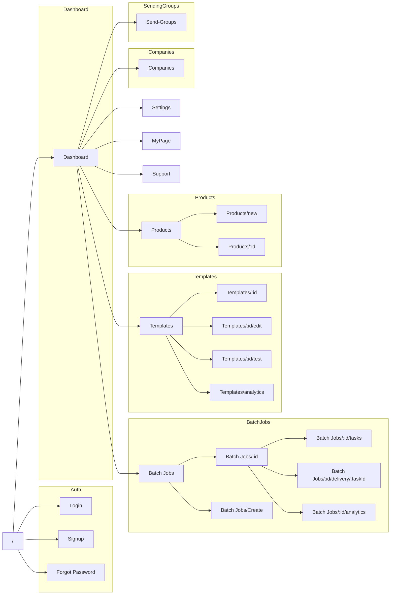

# フロントエンドページ設計

## ページ構成図

## ページ詳細

### 認証関連
- **ログインページ** (`/login`)
  - メール/パスワードログイン
  - Googleログイン
  - パスワードリセットリンク

- **サインアップページ** (`/signup`)
  - メール/パスワード登録
  - Googleアカウント連携
  - 利用規約同意

- **パスワードリセット** (`/forgot-password`)
  - メールアドレス入力
  - リセットメール送信

### ダッシュボード
- **メインダッシュボード** (`/dashboard`)
  - 最近のバッチジョブ
  - テンプレート使用状況
  - KPI概要
  - 通知一覧

### バッチジョブ
- **バッチジョブ一覧** (`/batch-jobs`)
  - ジョブステータス
  - 進捗状況
  - フィルタリング機能

- **バッチジョブ詳細** (`/batch-jobs/:id`)
  - タスク一覧
  - エラー情報
  - 実行ログ

### テンプレート
- **テンプレート一覧** (`/templates`)
  - テンプレート検索
  - カテゴリフィルタ
  - 使用状況

- **テンプレート編集** (`/templates/:id/edit`)
  - AIアシスト機能
  - プレビュー
  - 変数挿入

### 企業情報
- **企業一覧** (`/companies`)
  - 企業検索
  - インポート/エクスポート
  - ステータス管理

### 設定
- **設定ページ** (`/settings`)
  - プロフィール設定
  - API設定
  - 通知設定
  - チーム管理