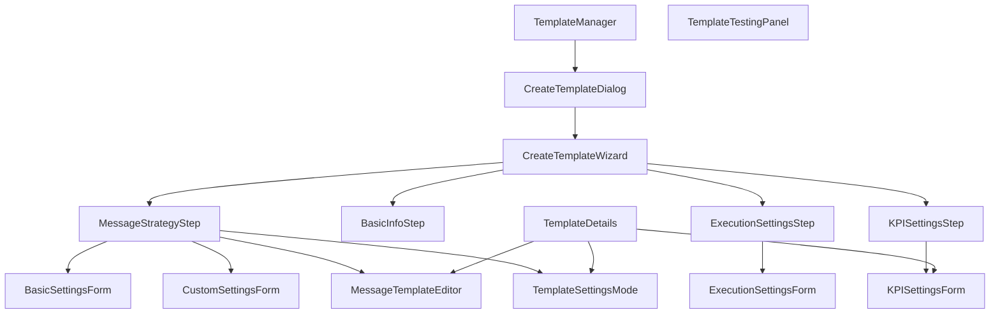
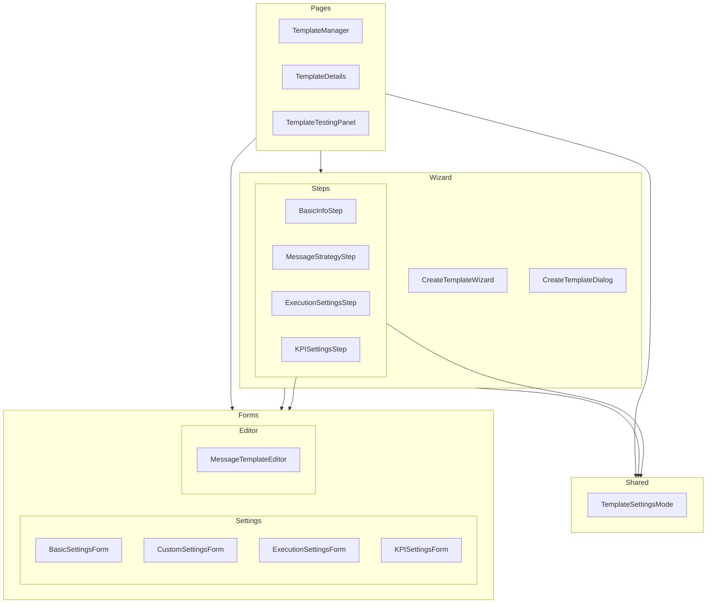
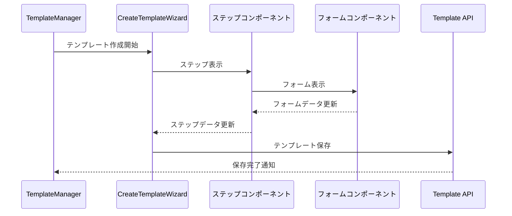

# テンプレートコンポーネントの依存関係

## コンポーネント階層図

## コンポーネントグループ

## データフロー

## 注意点

1. **循環依存の防止**
   - ページコンポーネントはフォームを直接使用可能
   - フォームコンポーネントは他のコンポーネントに依存しない
   - 共有コンポーネントは他のコンポーネントに依存しない

2. **状態管理**
   - ページレベルで主要な状態を管理
   - フォームは内部状態のみを管理
   - ステップ間のデータ共有はウィザードを介して行う

3. **再利用性**
   - フォームコンポーネントは独立して再利用可能
   - 共有コンポーネントは汎用的に使用可能
   - ステップコンポーネントはウィザード固有 