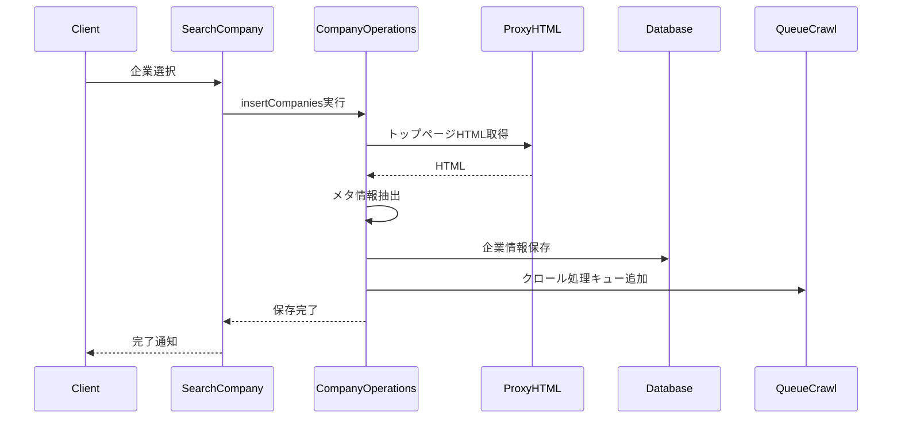

# 選択企業の保存処理の改善

## 大目的
企業情報の保存プロセスを改善し、より正確で詳細な企業情報を効率的に保存・管理できるようにする。
これにより、営業活動に必要な企業情報の質を向上させ、営業担当者の意思決定をサポートする。

## 情報取得プロセス

### 1. 検索時の初期情報取得
- 実行タイミング：企業検索時
- 取得方法：Google Custom Search APIのスニペット
- 保存先：
  - `companies.name`: 会社名
  - `companies.description`: 企業概要
- 用途：企業の基本情報取得、検索結果での表示

### 2. 手動入力情報
- 実行タイミング：企業情報編集時
- 入力方法：ユーザーによる手動入力
- 保存先：`companies.business_description`等の手動入力フィールド
- 用途：営業担当者による詳細な企業情報の管理
- 備考：自動取得された情報の修正・補完が必要な場合に使用

### 3. 詳細情報のクローリング
- 実行タイミング：企業登録後の非同期処理
- 取得方法：Firecrawlによる本格的なクローリング
- 保存先：`companies.website_content`カラム
- 用途：詳細な企業分析、セールスレターの品質向上

## 処理フローの概要



## データ型の対応

### フィールドの分類

#### 手動入力フィールド
1. 基本情報
   - `industry`: 業種
   - `business_description`: 事業内容の説明（手動入力用）
   - `founded_year`: 設立年
   - `employee_count`: 従業員数
   - `notes`: メモ

2. 連絡先情報
   - `contact_email`: 連絡先メールアドレス
   - `contact_form_url`: お問い合わせフォームURL
   - `phone`: 電話番号
   - `address`: 住所

#### 自動取得フィールド
1. 検索時の初期情報
   - `name`: 会社名（Google Custom Search APIから取得）
   - `description`: Google Custom Search APIから取得した企業概要

2. Webクローリング情報
   - `url`: 会社のWebサイトURL
   - `website_content`: Firecrawlで取得したWebサイトのコンテンツ
   - `last_crawled_at`: 最終クロール日時

3. システム管理情報
   - `id`: システム内部ID
   - `created_at`: 作成日時
   - `updated_at`: 更新日時
   - `user_id`: 作成ユーザーID

### Input
```typescript
// 企業保存リクエスト
interface SaveCompanyRequest {
  companies: Company[];
  userId: string;
  searchKeyword: string;
}

// Company型（既存）
interface Company {
  id: string;
  name: string;
  url?: string;
  industry?: string;
  contact_email?: string;
  contact_form_url?: string;
  phone?: string;
  address?: string;
  employee_count?: number;
  business_description?: string;
  founded_year?: number;
  notes?: string;
  website_content?: string;
  last_crawled_at?: string;
  created_at?: string;
  updated_at?: string;
  user_id?: string;
}
```

### Output
```typescript
// 保存結果
interface SaveCompanyResult {
  companies: Company[];
  error?: string;
}
```

## ファイルツリー
```
src/
├── components/
│   ├── SearchCompany.tsx        # 企業検索・選択UI
│   └── CompanyManager.tsx       # 企業管理UI
├── types/
│   └── company.ts              # 企業関連の型定義
└── hooks/
    └── useCompanies.ts         # 企業データ操作フック

supabase/
└── functions/
    ├── company-operations/     # 企業操作関数
    │   └── index.ts
    ├── proxy-html/            # HTMLプロキシ
    │   └── index.ts
    ├── queue-crawl/           # クロール処理キュー
    │   └── index.ts
    └── _shared/              # 共有ユーティリティ
        ├── cors.ts
        ├── supabase-client.ts
        └── utils.ts
```

## 修正対象ファイルと変更内容

### 1. `src/components/SearchCompany.tsx`
#### 現状
- 企業選択時に基本情報のみを保存
- トップページのメタ情報取得が不完全
- エラーハンドリングが不十分

#### あるべき姿
```typescript
const handleConfirmSelection = async () => {
  try {
    const selectedCompanies = searchResults.filter(company => 
      selectedCompanies.has(company.id)
    );

    const { data: result, error } = await supabase.functions.invoke('company-operations', {
      body: {
        action: 'insertCompanies',
        data: {
          companies: selectedCompanies,
          userId: session.user.id,
          searchKeyword
        }
      }
    });

    if (error) throw error;
    onCompaniesSelected(result);
    onClose?.();

  } catch (error) {
    console.error('企業登録エラー:', error);
    setSearchAlertMessage('企業の登録に失敗しました');
  }
};
```

### 2. `supabase/functions/company-operations/index.ts`
#### 現状
- HTMLの取得と解析が不十分
- エラーハンドリングが不完全
- クロール処理の連携がない

#### あるべき姿
```typescript
export async function insertCompanies(
  companies: Partial<Company>[],
  shouldQueueCrawl: boolean = false
) {
  console.log('企業登録開始:', companies);

  try {
    // 1. 重複チェック
    const urls = companies.map(company => company.url).filter(Boolean);
    const { data: existingCompanies } = await supabase
      .from('companies')
      .select('url')
      .in('url', urls);

    // 2. 重複を除外
    const filteredCompanies = companies.filter(company => {
      return !existingCompanies?.some(existing => 
        existing.url === company.url
      );
    });

    // 3. トップページのメタ情報取得
    for (const company of filteredCompanies) {
      if (company.url) {
        try {
          const { data } = await supabase.functions.invoke('proxy-html', {
            body: { url: company.url }
          });
          
          // 自動取得フィールドのみを更新
          const metaInfo = extractMetaInfo(data.html);
          company.website_content = metaInfo.content;
          company.last_crawled_at = new Date().toISOString();

          // 手動入力フィールドは既存の値を保持
          const { data: existingData } = await supabase
            .from('companies')
            .select('business_description, notes')
            .eq('url', company.url)
            .single();

          if (existingData) {
            company.business_description = existingData.business_description;
            company.notes = existingData.notes;
          }
        } catch (error) {
          console.error(`メタ情報取得エラー: ${company.url}`, error);
          await logError(error, { url: company.url });
        }
      }
    }

    // 4. 企業情報の保存（手動入力フィールドを優先）
    const { data: insertedCompanies, error } = await supabase
      .from('companies')
      .upsert(filteredCompanies.map(company => ({
        ...company,
        created_at: new Date().toISOString(),
        // 手動入力フィールドが未設定の場合のみ、デフォルト値を設定
        business_description: company.business_description || null,
        notes: company.notes || null
      })))
      .select();

    if (error) throw error;

    // 5. クロール処理のキューイング
    if (shouldQueueCrawl && insertedCompanies) {
      for (const company of insertedCompanies) {
        if (company.url) {
          await supabase.functions.invoke('queue-crawl', {
            body: { company_id: company.id }
          });
        }
      }
    }

    return insertedCompanies;

  } catch (error) {
    console.error('企業登録エラー:', error);
    throw error;
  }
}
```

### 3. `supabase/functions/proxy-html/index.ts`
#### 現状
- エンコーディング処理が不完全
- エラーハンドリングが不十分
- キャッシュ制御が不適切

#### あるべき姿
```typescript
export const serve = async (req: Request): Promise<Response> => {
  if (req.method === 'OPTIONS') {
    return new Response('ok', { headers: corsHeaders });
  }

  try {
    const { url } = await req.json();
    
    if (!isValidUrl(url)) {
      return new Response(
        JSON.stringify({ error: 'Invalid URL' }),
        { 
          status: 400,
          headers: { ...corsHeaders, 'Content-Type': 'application/json' }
        }
      );
    }

    const clientId = req.headers.get('x-forwarded-for') || 'default';
    if (!checkRateLimit(clientId)) {
      return new Response(
        JSON.stringify({ error: 'Rate limit exceeded' }),
        { 
          status: 429,
          headers: { ...corsHeaders, 'Content-Type': 'application/json' }
        }
      );
    }

    const response = await fetch(url, {
      headers: {
        'User-Agent': 'Mozilla/5.0 (compatible; AISalesAssistant/1.0)',
        'Accept': 'text/html,application/xhtml+xml,application/xml;q=0.9,*/*;q=0.8',
        'Accept-Language': 'ja,en-US;q=0.7,en;q=0.3'
      }
    });

    if (!response.ok) {
      throw new Error(`Failed to fetch URL: ${response.status}`);
    }

    const contentType = response.headers.get('content-type');
    let charset = 'utf-8';
    
    if (contentType) {
      const match = contentType.match(/charset=([^;]+)/i);
      if (match) charset = match[1].toLowerCase();
    }

    const buffer = await response.arrayBuffer();
    const uint8Array = new Uint8Array(buffer);
    
    let html = '';
    const encodings = [charset, 'utf-8', 'shift-jis', 'euc-jp', 'iso-2022-jp'];
    
    for (const encoding of encodings) {
      try {
        const decoder = new TextDecoder(encoding);
        const decoded = decoder.decode(uint8Array);
        
        if (/[\u3000-\u303f\u3040-\u309f\u30a0-\u30ff\u4e00-\u9faf]/.test(decoded)) {
          html = decoded;
          break;
        }
      } catch {
        continue;
      }
    }

    if (!html) {
      throw new Error('Failed to decode content with any encoding');
    }

    return new Response(
      JSON.stringify({ html }),
      { 
        headers: { 
          ...corsHeaders,
          'Content-Type': 'application/json',
          'Cache-Control': 's-maxage=86400'
        }
      }
    );

  } catch (error) {
    console.error('Error in proxy-html:', error);
    return new Response(
      JSON.stringify({ 
        error: 'Failed to fetch URL',
        details: error instanceof Error ? error.message : 'Unknown error'
      }),
      { 
        status: 500,
        headers: { ...corsHeaders, 'Content-Type': 'application/json' }
      }
    );
  }
};
```

## テスト項目

### 1. 企業情報の保存
- [ ] 会社名が正しく保存されることを確認
- [ ] スニペット情報が`business_description`として保存されることを確認
- [ ] メタ情報が`website_content`に保存されることを確認
- [ ] スクレイピング内容が`website_content`に追加されることを確認
- [ ] 重複企業が正しく処理されることを確認
- [ ] 文字エンコーディングが正しく処理されることを確認

### 2. エラーハンドリング
- [ ] トップページ取得失敗時の動作確認
- [ ] スクレイピング失敗時の動作確認
- [ ] リトライ処理の動作確認
- [ ] レートリミット超過時の動作確認
- [ ] 無効なURL時の動作確認
- [ ] タイムアウト時の動作確認

### 3. パフォーマンス
- [ ] 大量データ処理時の動作確認
- [ ] 同時リクエスト時の動作確認
- [ ] キャッシュの効果確認
- [ ] メモリ使用量の確認

## その他の考慮事項
- 保存処理の非同期化を検討
- スクレイピング内容の更新スケジュール設定
- データ容量の監視と制限の検討
- ロギングとモニタリングの強化
- バックアップ戦略の検討
- セキュリティ対策の強化（XSS対策、SQLインジェクション対策など） 