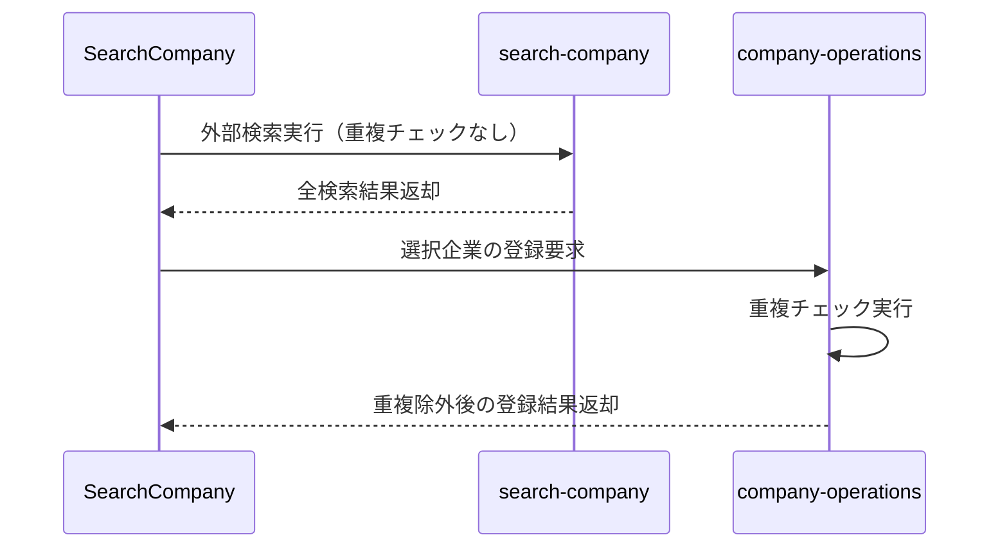

# 企業検索における重複チェックの最適化

## 現状の問題

### 1. 症状
- 検索時の重複チェックにより、新しい企業情報の取得が制限される可能性がある
- 登録時の重複チェックが不十分
- 意図しない内部検索が実行される

### 2. エラーログ
```
[Info] リクエスト受信: {
  action: "searchCompanies",
  data: {
    userId: "a7de1c8b-6ebf-46a3-9c86-50246617e8aa",
    page: 1,
    itemsPerPage: 50,
    domainRestriction: ""
  }
}

[Info] 企業検索開始: {
  keyword: undefined,
  userId: "a7de1c8b-6ebf-46a3-9c86-50246617e8aa",
  page: 1,
  itemsPerPage: 50,
  domainRestriction: "",
  searchType: "default"
}
```

## プロジェクト構造

### 1. 関連ファイル
```
src/
├── components/
│   ├── SearchCompany.tsx      # 企業検索UI
│   └── CompanyManager.tsx     # 企業管理UI
├── types/
│   └── company.ts            # 企業関連の型定義
└── utils/
    └── company/
        └── companyExtractor.test.ts

supabase/
└── functions/
    ├── company-operations/   # 企業操作関数
    │   └── index.ts
    ├── search-company/      # 外部検索機能
    │   └── index.ts
    └── _shared/            # 共有ユーティリティ
        ├── cors.ts
        ├── supabase-client.ts
        └── types.ts
```

### 2. 主要コンポーネントの役割
- `SearchCompany.tsx`: 企業検索UIと検索ロジック
- `company-operations`: 内部DB操作と外部検索の統合
- `search-company`: Google Custom Search APIを使用した外部検索

## 改善後の実装フロー

### 1. 検索プロセス


### 2. 重複チェックの実装方針
1. 検索フェーズ
   - 重複チェックを行わない
   - Google Custom Search APIの結果をそのまま表示
   - ユーザーに全ての選択肢を提供

2. 登録フェーズ
   - URL正規化による厳密な重複チェック
   - 企業名の類似度による緩やかな重複チェック
   - 重複が見つかった場合は更新オプションを提供

## 検討が必要な点

### 1. 登録時の重複チェックアルゴリズム
- URL正規化ルールの定義
- 企業名の類似度計算方法
- 重複判定の閾値設定

### 2. パフォーマンス考慮事項
- 登録時の重複チェック処理の最適化
- インデックスの活用
- バッチ処理の可能性

### 3. エッジケース
- URLが存在しない企業の重複チェック
- 企業名の表記揺れへの対応
- 子会社・関連会社の識別

## 改善案の要件

### 1. 機能要件
- 効率的な登録時重複チェック
- 柔軟な重複判定基準
- 重複検出時の更新オプション提供

### 2. 非機能要件
- 登録処理のレスポンス時間維持
- スケーラビリティの確保
- メンテナンス性の向上

## 分析依頼事項

1. 登録時重複チェックアルゴリズムの提案
   - URL正規化ルール
   - 企業名類似度計算方法
   - 判定基準の最適化

2. 登録プロセスの最適化
   - 重複チェックの並列処理
   - インデックス設計
   - キャッシュ戦略

3. データ構造の改善提案
   - 重複チェック用インデックス
   - 正規化戦略
   - 更新履歴の管理

## 期待される成果物

1. 登録時重複チェックアルゴリズムの詳細設計
2. データベースインデックス設計
3. 実装手順と優先順位
4. テスト戦略の提案 