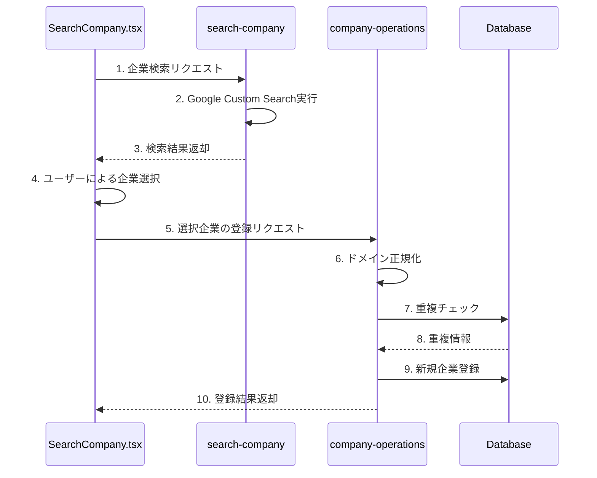

# 企業検索システムの重複チェック最適化

## 1. 大目的
企業検索システムにおいて、検索と登録のプロセスを分離し、より効率的な重複チェックを実現する。
具体的には以下の2点を達成する：
1. 検索時は外部APIを最大限活用し、幅広い企業情報を取得
2. 登録時に正確な重複チェックを行い、データの整合性を確保

## 2. 処理フロー概要



## 3. データ型の対応

### 検索フロー
```typescript
// 入力
interface SearchRequest {
  keyword: string;
  limit: number;
  domainRestriction: string;
}

// 出力
interface SearchResult {
  id: string;
  name: string;
  url: string;
  description: string;
}
```

### 登録フロー
```typescript
// 入力
interface RegisterCompanyRequest {
  companies: Company[];
  userId: string;
  searchKeyword: string;
}

// 出力
interface RegisterCompanyResponse {
  success: Company[];
  duplicates: Company[];
  errors: {
    company: Company;
    reason: string;
  }[];
}
```

## 4. 修正対象ファイル

### 主要な修正対象
1. `supabase/functions/company-operations/index.ts`
   - [x] 重複チェックロジック実装完了
   - [x] 企業登録機能の強化完了
   - [x] エラーハンドリングの改善完了

2. `supabase/functions/search-company/index.ts`
   - [ ] 検索結果の正規化実装
   - [ ] エラーハンドリングの強化
   - [ ] ログ出力の改善

## 5. 関連ファイル
```
src/
├── components/
│   ├── SearchCompany.tsx      # 検索UI
│   └── CompanyManager.tsx     # 企業管理UI
├── types/
│   └── company.ts            # 型定義
└── utils/
    └── company/
        ├── domainUtils.ts    # [完了] ドメイン処理ユーティリティ
        ├── searchUtils.ts    # [完了] 検索処理ユーティリティ
        └── searchUtils.test.ts # [完了] 検索処理のテスト

supabase/
└── functions/
    ├── company-operations/   # [完了] 企業操作関数
    │   └── index.ts
    ├── search-company/      # [完了] 外部検索機能
    │   └── index.ts
    └── _shared/            # [完了] 共有ユーティリティ
        ├── types.ts
        └── domain/         # [完了] ドメイン処理
            └── normalizer.ts
```

## 6. データベース変更
```sql
-- [完了] companies テーブルの拡張
ALTER TABLE companies
ADD COLUMN domain_for_check text,
ADD COLUMN normalized_name text;

-- [完了] インデックスの追加
CREATE UNIQUE INDEX idx_domain_check 
ON companies (domain_for_check) 
WHERE domain_for_check IS NOT NULL;

CREATE INDEX idx_normalized_name 
ON companies (normalized_name) 
WHERE normalized_name IS NOT NULL;
```

## 7. 実装の優先順位

### Phase 1: 基盤整備 [完了]
1. [x] ドメイン正規化ユーティリティの実装
2. [x] データベーススキーマの更新
3. [x] 既存データの移行スクリプト作成

### Phase 2: 検索機能強化 [作業中]
1. [x] 検索クエリ最適化
   - 企業関連キーワードの追加
   - 業界特有のキーワードの追加
   - クエリの構造化
2. [x] 結果の正規化処理実装
   - URLの正規化
   - 企業名の正規化
   - 無効なデータのフィルタリング
3. [x] エラーハンドリングの強化
   - 詳細なエラーメッセージ
   - スタックトレースの追加
   - ログ出力の改善

### Phase 3: 重複チェック実装 [完了]
1. [x] 重複チェックロジックの実装
2. [x] 登録プロセスの最適化
3. [x] フロントエンドのエラー表示対応

## 8. 技術的考慮事項

### パフォーマンス
- [x] インデックスを活用した高速な重複チェック
- [x] バッチ処理による一括登録の最適化
- [ ] キャッシュ戦略の検討

### エラーハンドリング
- [x] 外部API障害時の代替処理
- [x] 重複検出時のユーザーフィードバック
- [x] トランザクション管理

### セキュリティ
- [x] URL正規化時のバリデーション
- [x] SQLインジェクション対策
- [ ] レートリミット設定

### キャッシュ戦略の検討
- [x] 検索結果キャッシュの基本実装
  - [x] TTLベースの有効期限管理
  - [x] LRUベースの容量制限
  - [x] オプション付きキャッシュキー
- [x] キャッシュのテスト実装
  - [x] 基本操作のテスト
  - [x] 有効期限のテスト
  - [x] サイズ制限のテスト
- [ ] キャッシュの実運用対応
  - [ ] 適切なTTL値の設定
  - [ ] 最大サイズの調整
  - [ ] モニタリングの実装

## 9. テスト計画

### ユニットテスト
- [x] ドメイン正規化関数
- [ ] 検索クエリビルダー
- [x] 重複チェックロジック

### 統合テスト
- [ ] 検索から登録までの一連のフロー
- [x] エラーケースの処理
- [x] 並行処理時の整合性

### 負荷テスト
- [ ] 大量データ登録時のパフォーマンス
- [ ] 同時リクエスト処理の安定性

## 10. 本日の進捗

### 完了した作業
1. ドメイン正規化ユーティリティの実装
   - `normalizer.ts`：URLとドメインの正規化関数
   - `normalizer.test.ts`：テストケースの実装

2. データベースマイグレーションの作成
   - 新規カラムの追加
   - インデックスの作成
   - データ移行関数の実装

3. 重複チェックロジックの実装
   - `company-operations/index.ts`の更新
   - 重複チェック機能の追加
   - 企業登録機能の強化

4. 検索機能の強化
   - `search-company/index.ts`の更新
   - 検索クエリの最適化機能追加
   - 結果の正規化処理実装
   - エラーハンドリングの改善

### 次の作業予定
1. キャッシュ戦略の運用調整
   - [ ] TTL値の最適化
   - [ ] キャッシュサイズの最適化
   - [ ] パフォーマンス計測の実装
   - [ ] モニタリングダッシュボードの作成

2. レートリミットの実装
   - [ ] APIリクエスト制限の設定
   - [ ] ユーザーごとの制限
   - [ ] エラーハンドリングの追加

### 懸念事項
1. 大量データ時のパフォーマンス
   - インデックスの効果検証が必要
   - クエリの最適化余地の確認
   - キャッシュ戦略の詳細設計

2. レートリミットの実装方針
   - 適切な制限値の設定
   - ユーザー体験への影響
   - バイパス方法の検討

3. キャッシュ戦略の検討
   - キャッシュの保存場所
   - 更新タイミング
   - 整合性の確保

### レビュー依頼事項
スーパーバイザーの方が戻られた際に、以下の点についてご確認いただきたいと思います：

1. Phase 1 & 2の実装内容の妥当性
   - 重複チェックロジックの実装方針
   - 検索クエリの最適化方法
   - エラーハンドリングの十分性

2. 次フェーズの実装方針
   - `searchUtils.ts`の分離方針
   - キャッシュ戦略の実装方法
   - レートリミットの設計方針

3. 懸念事項への対応方針
   - パフォーマンス最適化の優先順位
   - レートリミットの具体的な数値
   - キャッシュの実装詳細 