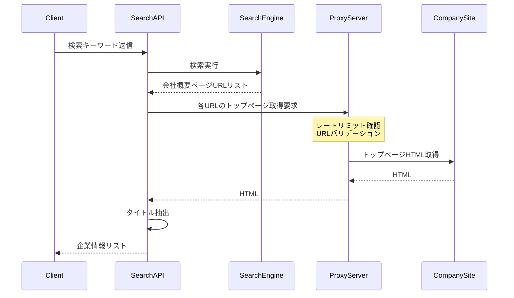

# 企業検索結果の表示改善：プロキシサーバー経由でのHTML取得

## 大目的
現状、Google検索APIから取得したタイトルをそのまま表示しており、「会社概要」などの一般的なページタイトルになっています。
これを、プロキシサーバー経由でトップページを取得し、ページタイトルを表示するように改善します。
この改善により、ユーザーが企業を正確に識別できるようになり、営業活動の効率が向上します。

## 処理フローの概要



## フータ型の対応

### Input
```typescript
// 検索リクエスト
interface SearchRequest {
  searchKeyword: string;
  limit: number;
  domainRestriction?: string;
  userId?: string;
  existingUrls: string[];
}

// プロキシリクエスト
interface ProxyRequest {
  url: string;
}
```

### Output
```typescript
// 検索結果
interface SearchResult {
  id: string;
  name: string;
  url: string;
  description?: string;
  industry?: string;
}

// プロキシレスポンス
interface ProxyResponse {
  html: string;
  error?: string;
  details?: string;
}
```

## ファイル構造
```
supabase/
└── functions/
    ├── search-company/
    │   ├── index.ts       # メインの修正対象
    │   └── config.toml    # 環境変数設定
    ├── proxy-html/
    │   ├── index.ts       # 実装済みのプロキシサーバー
    │   └── config.toml    # プロキシ設定
    └── _shared/
        ├── cors.ts        # CORS設定
        ├── types.ts       # 共通型定義
        └── utils.ts       # ユーティリティ関数
```

## 現状の実装

### search-company/index.ts
```typescript
// 企業情報の取得部分
const searchResults = await searchCompanies(searchKeyword, limit, domainRestriction);
results.push({
  id: crypto.randomUUID(),
  name: item.title.replace(/\s*[-|｜]\s*.*$/, ''), // 簡単な整形のみ
  url: accessibleUrl,
  description: item.snippet,
  industry: keyword
});
```

### proxy-html/index.ts（実装済み）
```typescript
// プロキシサーバーの主要機能
export const serve = async (req: Request): Promise<Response> => {
  const { url } = await req.json();
  // URLバリデーション
  if (!isValidUrl(url)) return new Response(JSON.stringify({ error: 'Invalid URL' }), { status: 400 });
  // レートリミット
  if (!checkRateLimit(clientId)) return new Response(JSON.stringify({ error: 'Rate limit exceeded' }), { status: 429 });
  // HTML取得
  const response = await fetch(url);
  const html = await response.text();
  return new Response(JSON.stringify({ html }));
};
```

## あるべき実装
```typescript
// search-company/index.ts
async function searchCompanies(searchKeyword: string, limit: number, domainRestriction: string): Promise<SearchResult[]> {
  const proxyServerUrl = Deno.env.get('PROXY_SERVER_URL');
  if (!proxyServerUrl) throw new Error('Proxy server URL is not configured');

  // 検索結果の取得（既存の実装）
  const searchResults = await getGoogleSearchResults(searchKeyword, limit, domainRestriction);
  
  // 各URLに対してプロキシ経由でHTMLを取得
  const results = await Promise.all(
    searchResults.map(async (item) => {
      try {
        const proxyResponse = await fetch(`${proxyServerUrl}`, {
          method: 'POST',
          headers: { 'Content-Type': 'application/json' },
          body: JSON.stringify({ url: item.url })
        });

        if (!proxyResponse.ok) {
          console.error(`プロキシサーバーエラー: ${item.url}`);
          return createSearchResult(item); // 現状の実装を使用
        }

        const { html, error } = await proxyResponse.json();
        if (error || !html) {
          console.error(`HTML取得エラー: ${item.url}, ${error}`);
          return createSearchResult(item); // 現状の実装を使用
        }

        const dom = new JSDOM(html);
        const title = dom.window.document.title;
        
        return {
          id: crypto.randomUUID(),
          name: title || item.title.replace(/\s*[-|｜]\s*.*$/, ''),
          url: item.url,
          description: item.snippet,
          industry: searchKeyword
        };
      } catch (error) {
        console.error(`処理エラー: ${item.url}`, error);
        return createSearchResult(item); // 現状の実装を使用
      }
    })
  );

  return results.filter(Boolean);
}

// ヘルパー関数
function createSearchResult(item: any): SearchResult {
  return {
    id: crypto.randomUUID(),
    name: item.title.replace(/\s*[-|｜]\s*.*$/, ''),
    url: item.url,
    description: item.snippet,
    industry: item.industry
  };
}
```

## 修正内容の詳細

### 1. プロキシサーバー連携の実装
- 環境変数`PROXY_SERVER_URL`の追加
- プロキシリクエストのエラーハンドリング
- レスポンスの適切なパース処理

### 2. エラー処理の実装
- プロキシサーバーエラー時のフォールバック
- HTML取得失敗時のフォールバック
- タイムアウト時のフォールバック
- エラーログの出力

### 3. パフォーマンス最適化
- Promise.allによる並列処理
- タイムアウト設定（5秒）
- エラー時の即時フォールバック

## テスト項目

### 1. 正常系テスト
- プロキシサーバー経由でのHTML取得
- タイトルの正常取得
- 検索結果への反映
- 並列リクエストの処理

### 2. 異常系テスト
- プロキシサーバーエラー時のフォールバック
- HTML取得失敗時のフォールバック
- タイムアウト時のフォールバック
- 無効なURLの処理
- レートリミット超過時の処理

## 完了条件
- [ ] プロキシサーバーとの連携が実装されている
- [ ] タイトルが正しく取得できる
- [ ] エラー時に適切なフォールバックが動作する
- [ ] パフォーマンスが許容範囲内である（レスポンスタイム3秒以内）
- [ ] エラーログが適切に出力される
- [ ] 環境変数が正しく設定されている 