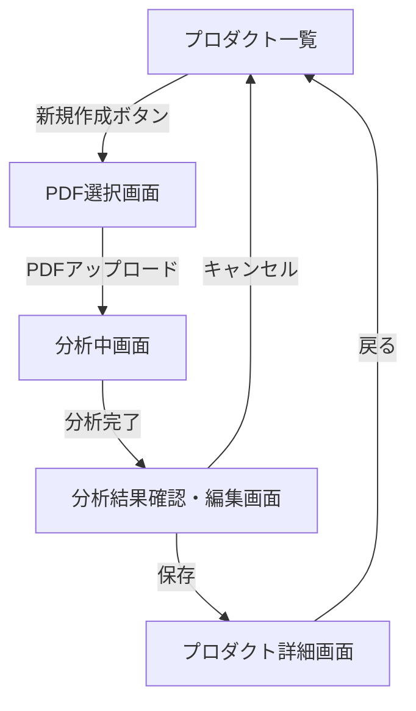

# プロダクト登録機能の実装詳細

## 概要
プロダクト登録機能の実装において、フロントエンドとバックエンドの役割分担と各ファイルでの実装内容を明確化する。

## 画面遷移フロー



## 画面イメージ

### 1. PDF選択画面
```
+----------------------------------+
|   プロダクト情報登録             |
+----------------------------------+
|                                  |
|   +----------------------------+ |
|   |                            | |
|   |     ドラッグ&ドロップ      | |
|   |          または            | |
|   |    クリックしてPDF選択     | |
|   |                            | |
|   +----------------------------+ |
|                                  |
|   [キャンセル]      [アップロード]|
+----------------------------------+
```

### 2. 分析中画面
```
+----------------------------------+
|   プロダクト情報分析中           |
+----------------------------------+
|                                  |
|          [ローディング]          |
|                                  |
|      PDFを分析しています...      |
|                                  |
+----------------------------------+
```

### 3. 分析結果確認・編集画面
```
+----------------------------------+
|   分析結果の確認・編集           |
+----------------------------------+
|                                  |
| プロダクト名: [________________] |
|                                  |
| 課題:                           |
| [                               ]|
| [                               ]|
|                                  |
| 解決策:                         |
| [                               ]|
| [                               ]|
|                                  |
| メリット:                       |
| [                               ]|
| [                               ]|
|                                  |
| USP:                            |
| [                               ]|
| [                               ]|
|                                  |
|   [キャンセル]          [保存]   |
+----------------------------------+
```

## 実装フロー
1. ユーザーがPDFをアップロード
2. フロントエンドでテキスト抽出
3. generate-llmで分析
4. ユーザーが確認・編集
5. uploadで永続化

## フロントエンド実装

### 1. ProductPDFUploader.tsx
**役割**: メインのアップロードコンポーネント
**実装内容**:
- PDFファイルのドラッグ&ドロップUI
- ファイルサイズのバリデーション（10MB制限）
- PDFテキスト抽出の呼び出し
- generate-llmエンドポイントの呼び出し
- 分析結果の一時保持
- アップロードエンドポイントの呼び出し

### 2. AnalysisResultViewer.tsx
**役割**: 分析結果表示・編集コンポーネント
**実装内容**:
- 分析結果の表示（4項目）
  - 課題
  - 解決策
  - メリット
  - USP
- 編集機能の実装
- 保存ボタンの実装
- バリデーション機能

### 3. pdf-extractor.ts
**役割**: PDFテキスト抽出ユーティリティ
**実装内容**:
- PDFからテキスト抽出機能
- テキストの前処理
- エラーハンドリング

### 4. analyze-pdf.ts
**役割**: PDF分析関連のユーティリティ
**実装内容**:
- generate-llmエンドポイントとの通信処理
- レスポンスの整形
- エラーハンドリング

## バックエンド実装

### 1. generate-llm/index.ts
**役割**: テキスト分析エンドポイント
**実装内容**:
- PDFテキストの受信処理
- AIモデルの選択ロジック
- プロンプトの生成
- 4項目の抽出処理
  - 課題の抽出
  - 解決策の抽出
  - メリットの抽出
  - USPの抽出
- レスポンス生成

### 2. upload/index.ts
**役割**: ファイルアップロードエンドポイント
**実装内容**:
- ユーザー認証処理
- プロダクト情報のバリデーション
  - 必須項目チェック
  - 重複チェック
- プロダクト情報のDB保存
- PDFファイルのストレージ保存
  - ファイル名の正規化
  - ストレージへのアップロード
- アップロード情報のDB保存
- エラーハンドリング

## 実装進捗

### 2024-01-02 実装済み
1. ✅ `ProductPDFUploader.tsx`
   - PDFファイルのドラッグ&ドロップUI
   - ファイルサイズのバリデーション（10MB制限）
   - アップロード状態の管理
   - エラーハンドリング

2. ✅ `analyze-pdf.ts`
   - PDFテキスト分析機能の実装
   - generate-llmエンドポイントとの通信処理
   - 分析結果の型定義
   - エラーハンドリング

3. ✅ `pdf-extractor.ts`
   - PDFテキスト抽出機能の実装
   - PDFワーカーの初期化処理
   - テキストの前処理
   - エラーハンドリング

4. ✅ `AnalysisResultViewer.tsx`
   - 分析結果の表示UI
   - プロダクト名入力フィールド
   - 4項目の編集フォーム
   - バリデーション機能
   - 保存・キャンセル機能
   - エラー表示

### 次の実装タスク
1. 🔄 バックエンド実装
   - [ ] generate-llmエンドポイントの実装
   - [ ] uploadエンドポイントの実装

### 残課題
1. 型の共通化
   - `AnalysisResult`型の共通モジュール化
   - バックエンドとフロントエンドで型を共有

2. エラーハンドリングの改善
   - エラーメッセージの多言語対応
   - エラー種別の詳細化

3. UI/UXの改善
   - ローディング表示の改善
   - エラー表示の改善
   - アクセシビリティ対応

## 注意事項
- 各コンポーネント間の責務の明確な分離
- 適切なエラーハンドリングの実装
- ユーザー体験を考慮したUI/UXの実装
- パフォーマンスを考慮した実装 

## 画面遷移時の状態管理

### PDF選択画面
- 初期状態：
  - アップロードボタン: 無効
  - ファイルドロップエリア: 有効
- ファイル選択後：
  - アップロードボタン: 有効
  - ファイルサイズチェック: 即時実行
  - ファイル形式チェック: 即時実行

### 分析中画面
- 状態表示：
  - プログレスインジケータ
  - キャンセル不可
  - バックグラウンド処理の進行状況表示

### 分析結果確認・編集画面
- 編集可能項目：
  - プロダクト名（必須）
  - 課題（必須）
  - 解決策（必須）
  - メリット（必須）
  - USP（必須）
- バリデーション：
  - 必須項目の入力チェック
  - プロダクト名の重複チェック
- 保存ボタンの制御：
  - 必須項目が未入力の場合は無効
  - バリデーションエラーがある場合は無効

## エラーハンドリング
- ファイルアップロードエラー：
  - ファイルサイズ超過
  - 不正なファイル形式
  - アップロード失敗
- 分析エラー：
  - テキスト抽出失敗
  - AI分析失敗
  - タイムアウト
- 保存エラー：
  - 重複エラー
  - バリデーションエラー
  - サーバーエラー 